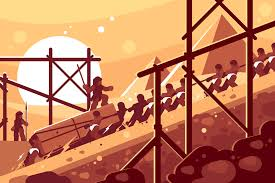
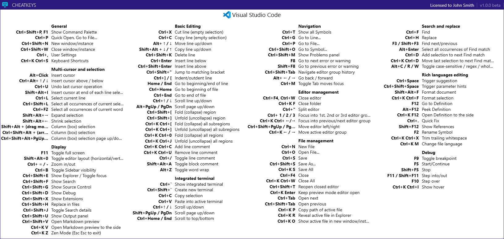

# שלב 1 - הנחת יסודות

## תיאור השלב

בשלב זה ילמד הבסיס של פיתוח וובי, בסופו הנחפף ישלוט ברמה בסיסית בreact, JavaScript, TypeScript ו css.

**ודאו שיש לכם את דף הקיצורים בVS-CODE מודפס ומנויילן על השולחן**

## דרישות מוקדמות

- ידע בסיסי בJavaScript
- ידע בסיסי בHTML

במידה ואתם לא מכירים כלל JavaScript או HTML בחרו אחת המדרכים הבאות ללמוד את החומרים:

1.קריאה + ביצוע (מומלצת):

[JS](https://www.theodinproject.com/paths/foundations/courses/foundations#javascript-basics)

[HTML](https://www.theodinproject.com/paths/foundations/courses/foundations#html-foundations)

מדובר ברמה גבוהה מאוד מאתר מעולה בשם [the odin project](https://www.theodinproject.com)
כל החומרים בו מומלצים ושווים קריאה!

2.למידה מסרטונים (מהירה יותר):

[JS](https://www.youtube.com/watch?v=W6NZfCO5SIk)

[HTML](https://www.youtube.com/watch?v=FQdaUv95mR8)

## שלבי הלמידה

תחילה יש לקחת את קורסי [הudemy](https://www.udemy.com/home/my-courses/learning/) מהחשבון של הצוות (פרטי התחברות אצל החופף והרשץ)

בסדר הבא:

React:

- 1-2

CSS:

- 1-6
- 8-9
- 11
- 13-15

TS:

- 1-2
- 5 (interfaces)
- 14

React:

- 3-13

**במהלך הקורסים יש לכתוב את הקוד יחד עם המדריך במחשב שלכם ולהתנסות בכתיבה לבד בכל הזדמנות אפשרית!**

## תרגילים

תחת תקיית תרגילים יש מספר תרגילים שמטרתם לחדד את הבנתכם ולתת לכם קצת ניסיון פרקטי בסוף כל חלק של udemy יש לבצע את התרגיל המתאים לו ולעבור עליו עם החופף.

**שמרו את הפתרונות שלכם !**

את התרגיל המסכם יש לעשות בסוף למידת כל הפרקים ולבצע עליו קוד review עם החופף.

## VS CODE CHEATSHEET:

