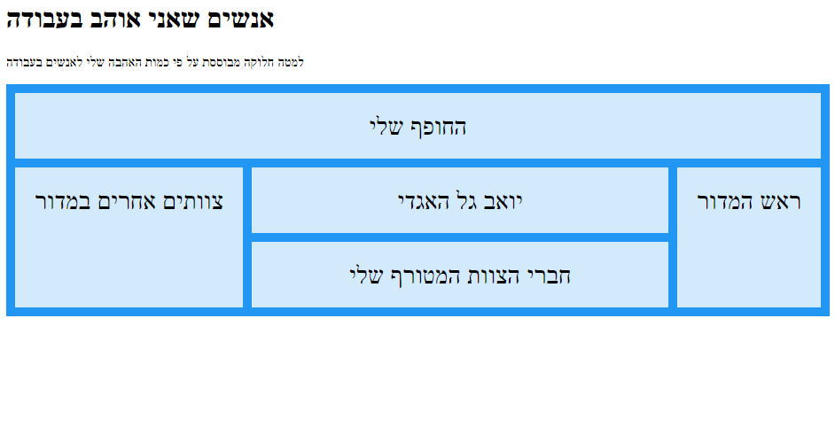

# שאלות הבנה CSS 01

## הקדמה

בקובץ זהה שאלות ומשימות הבנה שמטרתן לעזור למה שלמדת לשקוע ולהיזכר יותר טוב!
יש לשמור את התשובות בקובץ ולעבור עליהן עם החופף.

**במידה ואתם לא יודעים את אחת התשובות (זה בסדר) נסו להיעזר באינטרנט**.

---

## שאלות

#### תן דוגמאות ל 5 שוניםselectors

#### מהו הBox modal? פרט על חלקים השונים בו

#### מהו display? פרט על סוגיו השונים

#### מה זה !importent?

#### מה הן psuedo classes? תן דוגמה ל 3 מהן

#### פרט על סוגי הposition השונים

#### במקרה בו שני אלמנטים עולים אחד על השני כיצד נקבע מי מקדימה ומי מאחורה?

#### מנה את יחידות המידה השונות ופרט עליהן?

#### מה ההבדל בין Justify content ו alline items?

#### מתי נשתמש בtransform?

## משימות

#### בנה את את התמונה הבאה:

#### פתור את האתגרים הבאים:

- [אתגר א](https://cssbattle.dev/play/80)

- [אתגר ב](https://cssbattle.dev/play/122)

- [אתגר ג](https://cssbattle.dev/play/39)

#### כתוב 3 שאלות נוספתו שאפשר לשאול על מה שלמדת עד עכשיו שיהיה אפשר לשאול את הנחפפים הבאים 1 מהן לפחות צריכה לכלול קוד (שהם יכתבו).
