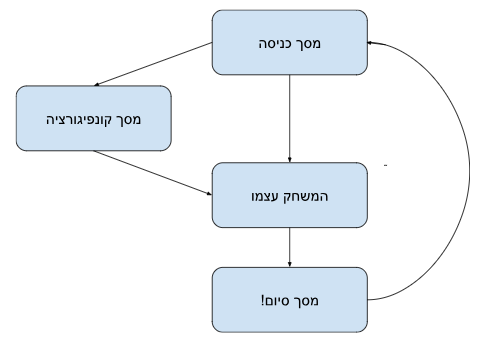

# Quiz App

## מטרה והקדמה

בפרוייקט זה נתרגל בניית אפליקצית react בסיסית, הפרוייקט יכלול, התממשקות עם api חיצוני וכיף. בתרגיל לא נשתמש בסיפריות עיצוב או עזרים נוספים כי מטרתו היא לתרגל react ו css בסיסי

### בפורייטנעבוד עם:

- TypeScript
- React
- [Open triva api](https://opentdb.com/api_config.php)
- [Trump API](https://whatdoestrumpthink.com/api-docs/index.html#get-a-random-trump-quote)

### דגשים חשובים

- קוד קריא, נקי ויפה.
- שמות משתנים משמעותיים.
- יש להשקיע בcss ולדאוג שאפליקציה תראה טוב - זה חלק קריטי מהתרגיל.
- אין להשתמש בספריות חיצוניות ללא אישור חופף, המטרה היא לחזק שליטה בבסיס לפני שמתקדמים האלה.
- ניתן ואף רצוי לשאול ולהתייעץ עם החופף/חברי הצוות אם תקלתם בבעיה/התלבטות. אך לא לצפות לתשובות.
- מומלץ בחום להעזיר באינטרנט כדי ללמוד ולהתמודד עם תקלות. אך בבקשה ממכם, **אל תעתיקו קטעי קוד/css גדולים. נסו לעשות זאת בעצמכם!**. (תופס במיוחד לגבי אפליקציות כמו chatGPT, כן לגיטימי לשאול אותו שאלות כמו איך למרכז Div, לא מומלץ לאפיין לו משהו ולהגיד לו תכתוב לי את זה).

---

## תיאור האפליקציה

בתרגיל נבנה אפליקצית חידונים. כפית מאוד!

### התחלת הפרוייקט

את הפרוייקט נפתח ונפתח בעזרת כלי מגניב שנקרא [vite](https://www.youtube.com/watch?v=KCrXgy8qtjM&t=78) אתם לא צריכים לדעת כלום על הכלי או איך משתמשים בו כרגע.

כדי לפתוח את הפרוייקט עקבו אחרי השלבים הבאים:

1. נפתח vs code CMD/teminal בתקייה בה אנחנו רוצים ליצור את הפרוייקט. בדרך כלל `C:\users\[your user]\[code projects folder]`.

2. נריץ את הפקודה
   `npm create vite@latest alpha-quiz `
   שnpm יבקש להתקין ספקיירה בשם vite-create (תאשרו)יכול להיות.
   נבחר React ואז typeScript.

3. נריץ את הפרקודה `code ./alpha-quiz` (שתפתח לכם את הפרוייט בVS-CODE ).

4. נפתח Terminal (ctr+\`) ונריץ `npm install`.

5. אחר כך נריץ `npm run dev` ונלחץ על הקישור לדפדן לראות את האפליקצה שלנו.

---

### מרכיבי האפלירציה

#### מסך פתיחה (Opening Screen)

- כותרת ותמונת רקע.
- כפתור משחק מהיר.
- כפתור למשחק מותאם אישית.

#### מסך הגדרות/ התאמה אישית (Settings Screen)

- בחירת מספר שאלות: Input לבחירת כמות השאלות בחידון (1-50).
- בחירת קטגוריה: Dropdown לבחירת קטגוריות השאלות.
- בחירת רמת קושי: Dropdown לבחירת קושי (קל, בינוני, קשה).
- בחירת סוג השאלות: אמריקאי או נכון/לא נכון.
- בחירת זמן לכל שאלה. (ב
  ין 20 שניות ל 2 דקות)
- כפתור תחילת המשחק.

#### מסך המשחק (Game Screen):

- שאלה: מציגה את השאלה.
- תשובות: כפתורים לבחירת התשובה.
- טיימר לכל שאלה.
- ציטוט מעורר השראה של Trump.
- תצוגת ניקוד עדכנית.

#### מסך סיום וסיכום (Summary Screen):

- הצגת ניקוד סופי.
- רשימת שאלות ותשובות שניתנו, הדגשת תשובות נכונות ולא נכונות.
- כפתור לחזרה למסך הפתיחה או למשחק נוסף.
- אם ניקוד השחקן גבוהה מ 75% מממקסימום הנקודות האפשרי באותו המשחק, הציגו זיקוקים על המסך! תעזרו בספרייה - fireworks.js.

## פונקציונליות חשובה

לחיצה על כפתור משחק מהיר תתחיל משחק עם הגדרות רנדומליות.

בסוף כל שאלה תיהיה אינדיקציה של האם התשובה שנבחרה היא התשובה הנכונה.

## מערכת הניקוד

כל תשובה נכונה מעניקה 800 נקודות.

אם השחק ענה על השאלה נכון בזמן קצר מספיק יקבל ניקוד בונוס לפי הנוסחה הבאה:

`200 * [מקדם זמן התשובה]`

### חישוב מקדם זמן התשובה

1.  לוקחים את אורך השאלה ומצאים כמה זה 40% ממנו - לצורך ההסבר נסמן בX
2.  מוצאים כמה זה 25% מX ומחסרים מX 25% X - לצורך ההסבר נסמן ב Y.
3.  את Y נחלק ל4 חלקים שווים ומקדם זמן התשובה שלנו יראה ככה:

| זמן מענה                      | מקדם זמן תשובה | חישוב             | נקודות סופיות |
| ----------------------------- | -------------- | ----------------- | ------------- |
| 0 - (25%X + 25%Y)             | 1              | 800 + (200\*1)    | 1000          |
| (25%X + 25%Y) - (25%X + 50%Y) | 0.75           | 800 + (200\*0.75) | 950           |
| (25%X + 50%Y) - (25%X + 75%Y) | 0.5            | 800 + (200\*0.5)  | 900           |
| (25%X + 75%Y) - (25%X +Y)     | 0.25           | 800 + (200\*0.25) | 850           |
| < X                           | 0              | 800 + (200\*0)    | 800           |

- טיפ קטן (נסו לפשט את הנוסחא כדי להרשים את החופף)

### Application flow:

# בהצלחה
