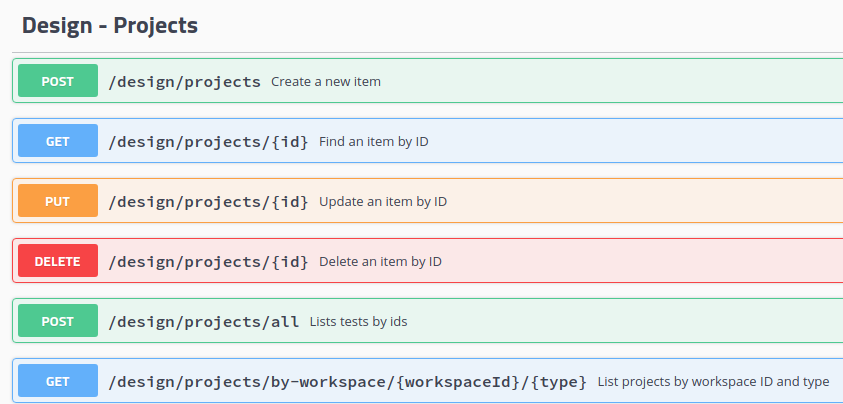

# דברים תיאורתים שצריך לדעת לפני שכותבים API

ארכיטקטורת Client-Server, HTTP, API, ו-REST הם מרכיבים מרכזיים בפיתוח ותקשורת על רשתות מחשבים. לכל אחד מהם הסבר קצר והפנייה ללמידה נוספת.

### ארכיטקטורת Client-Server

ארכיטקטורת Client-Server היא מודל תקשורת בין שני תוכנות: לקוח (Client) ושרת (Server). הלקוח מבקש שירות או משאב מהשרת, והשרת מעבד ומספק את הבקשה. דוגמה קלאסית היא דפדפן אינטרנט (לקוח) שמבקש מידע משרת אתר אינטרנט.

[המשיכו לקרוא כאן](https://www.geeksforgeeks.org/client-server-model/)

### HTTP (Hypertext Transfer Protocol)

פרוטוקול HTTP הוא פרוטוקול סטנדרטי לתקשורת ברשת האינטרנט. הוא מגדיר כיצד מתבצעת התקשורת בין לקוחות (דפדפנים, למשל) לשרתים. HTTP מבוסס על בקשה-תגובה (request-response), כאשר הלקוח שולח בקשה והשרת מחזיר תגובה.

- [המשיכו לקרוא כאן](https://medium.com/@imakashsharma135/understanding-request-and-response-model-a-general-overview-831c24d2288)

- [צפו בסרטון זה](https://www.youtube.com/watch?v=iYM2zFP3Zn0)

### API (Application Programming Interface)

API הוא ממשק תכנותי המאפשר לשני יישומים לתקשר זה עם זה. במקרה של רשתות, API מאפשר ליישומים לשלוח ולקבל נתונים בצורה מסודרת ובטוחה. זה מאפשר גמישות רבה בפיתוח יישומים שיכולים לתקשר עם שירותים שונים.

[צפו בסרטון זה](https://www.youtube.com/watch?v=ByGJQzlzxQg)

### REST (Representational State Transfer)

עיקרון REST הוא סטייל ארכיטקטורי לפיתוח API. הוא מבוסס על מטודולוגיות של HTTP ומקדם שימוש ב-URLs לייצוג משאבים. לדוגמה, ב-API מבוסס REST, ניתן לשלוח בקשת GET לשרת כדי לקבל מידע, או בקשת POST כדי ליצור משהו חדש.

[צפו בסרטון זה](https://www.youtube.com/watch?v=SLwpqD8n3d0)

## שאלות הבנה (ענו בקובץ נפרד)

- מהם http status codes?
- מהם query params?
- מה הם headers?
- מהן http cookies? מתי נרצה להשתמש במה?
- מהו https?

אם אתם לא בטוחים בתשובות, חפשו באינטרנט! (לא כל המידע קיים פה)
