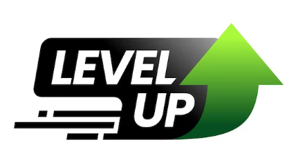

# LevelUp app

## מטרה והקדמה

בפרוייקט זה תבנו אפליקציית fullStack שלמה הכוללת טכנולוגיות רבות בהן אנחנו משתמשים בצוות במטרה שתכירו אותן יותר טוב ותתנסו ממש בעבודה איתן.
בנוסף הפרוייקט יחזק אצלכם את הבנות בכל הנושאים שלמדתם עד עכשיו והחיבורים בינהם ויתן לכם להתמודד עם בעיות בחיבורים בינהם!

## מזה LevelUP?

**LevelUp** - היא פלטפורמט בריאות שמטרתה לעזור למשתמשים לנהל חיים בראים יותר!

האפליקציה כוללת מעקב אחר הקלוריות שהמשתמש צורך, עזרה בתכנון ארוחות מעקב אחר ספורט ופעילות גופנית, הצבת יעדים מטרות אישיות, ניהול תקציב ,ודאש בורד מעקב.

## טכנולוגיות

**האפליקציה כולה תכתב בtypeScript!**

### חלק קדמי (Front-End)

1. **React**: ישמש כפלטפורמת הפיתוח הראשית שלך, ויבנה את הממשק המשתמש של האפליקציה.
2. **Redux ו-Redux Toolkit**: ינהלו את המצבים והנתונים באפליקציה, כמו נתוני משתמש, התקדמות, העדפות וכו'.
3. **Ant Design (antd)**: ישמש לעיצוב הממשק והרכיבים, ויעזור ליצור מראה עקבי ומקצועי.
4. **React Router**: ינהל את הניווט באפליקציה, מאפשר מעבר בין דפים ותצוגות שונות.
5. **Recharts**: ישמש ליצירת גרפים ותרשימים עבור ניתוח הנתונים של המשתמש, כמו תוצאות אימונים, התקדמות ועוד.
6. **LESS**: תשמש כשפת העיצוב של האפליקציה!

### חלק אחורי (Back-End)

1. **Fastify**: ישמש כשרת ה-Back-End, מספק מסגרת עבור ניהול בקשות API, טיפול בנתונים ותקשורת עם ה-Front-End.
2. **SQLite Database**: ישמש לאחסון נתונים כמו פרופילי משתמש, היסטוריית אימונים, התקדמויות ומידע נוסף.
3. **Docker**: ישמש לאריזת והפצת האפליקציה והסביבות שלה, ויעזור לשמור על עקביות בין סביבות הפיתוח, הבדיקה והפקה.

## שלבי פיתוח האפליקציה

1. קריאת מסמסך האיפיון ותכנון האפליקציה בכלליות וdb באופן בסיסי.
2. יבוא המידע על המזון מapi והכנסתו לקובץ זמני/db
3. תכנון ובניית הdb
4. תכנון האפליקציה ברמה הגבוהה
5. דיזיין ריביו - design review מעבר תכנון הפרוייקט בכללי עם החופף.
6. ביצוע הפרוייקט + cr תוך כדי.
