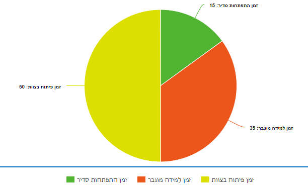

# שלב 4 - זמן למידה מוגבר

## תיאור השלב

בשלב זה אתם כבר מכירים קצת את המערכת, הגיע הזמן שתעבדו עליה קצת ותלמדו להכיר אותה קצת יותר מקרוב.

אם זאת, יש עוד דברים חשובים ששווה ללמוד בשביל לתת עבודה טובה בצוות. נושאים אלו ישפרו אותך ויעמיקו את הידע שלך בטכנולוגיות של הצוות ודברים שווים נוספים שיהפכו אותך לתוכניתן טוב יותר.

המטרה - להתחיל להכיר את המערכת ולתת תפוקה, תוך כדי הרמת הקמה המקצועית וצמצום הפער בין הנחפף לשאר להצוות.

עכשיו חלוקת הזמן שלכם בצוות תראה פחות או יותר ככה:

**כנראה שיהיה שונה בפעול!**

- זמן התפתחות סדיר הוא זמן שמודגר לכל הצוות להתמקצע בו (ימי אלפא בדרך כלל).
- זמן למידה מוגבר הוא הזמן בו תלמד את הנושאים מכאן!
- זמן פיתוח בצוות הוא זמן עבודה רגיל בו תקבל משימות ותעבוד כמו כולם.
- בנוסף: בתחילת השלב תצטרף קצת לתוכניתנים אחרים בצוות, תעבוד איתם ותלמד מהם!.

---

### TO DO LIST

- חפיפת k8s + openShift.
- nginx
